# Trabalho 3 de Visão Computacional - Color Indexing

## Executando o trabalho

Basta entrar no diretório do projeto e rodar o comando:

```bash
source run.sh
```

## Os objetos

Escolhi apenas 2 objetos, dois cubos mágicos, e fiz 9 cenas com eles.

As duas imagens abaixo são dos objetos:


Já as próximas duas eu cortei das próprias cenas em que faço a busca, chamarei
elas de objetos 3 e 4, mas são os mesmos dos 1 e 2, apenas para diferenciar as
imagens depois.


A ideia é ver se ter um objeto extremamente similar (se não basicamente
idêntico) faz tanta diferença na hora da indexação.

## Localizando os objetos com o algoritmo de Swain e Ballard

A ideia é colocá-los em cenas que atrapalhem a busca por comparação de
histogramas de cores, que é justamente a fraqueza do método, e estudar como que
essa fraqueza se comporta

> Para fins de ver o método funcionando também escolhi uma imagem com
> interferência mínima: a imagem 4.

A busca foi feita com base em um (tutorial do
OpenCV)[https://docs.opencv.org/3.4/dc/df6/tutorial_py_histogram_backprojection.html],
em que o objeto é um pedaço da própria imagem, a grama.

## Resultados

É importante ressaltar que todas as imagens usaram o mesmo threshold na , e por
experimentação percebeu-se certas imagens se davam melhor com diferentes threshholds,
então foi escolhido um que atendesse à média. O mesmo é dito sobre a escala da busca,
que o valor que deu o melhor resultado médio foi em torno de `0,8`.

### Objeto 1
#### Imagem 1

#### Imagem 2

#### Imagem 3
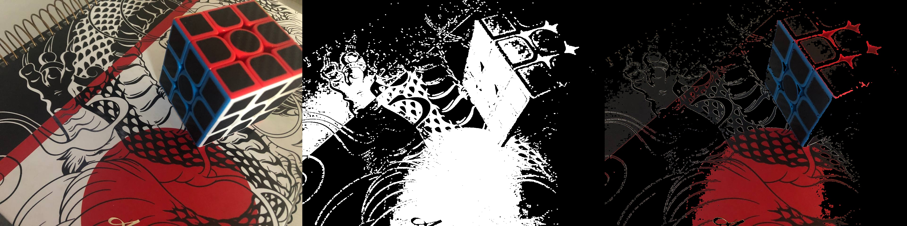
#### Imagem 4

#### Imagem 5
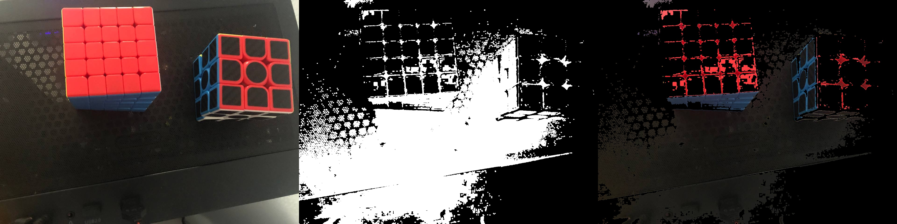
#### Imagem 6
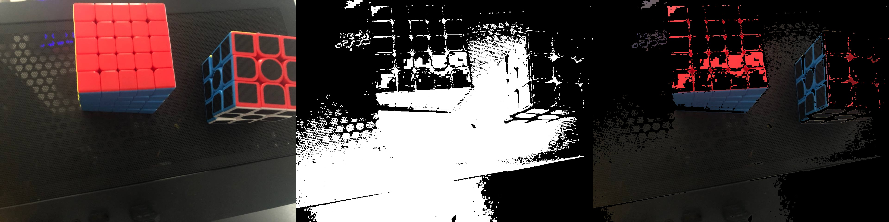
#### Imagem 7

#### Imagem 8
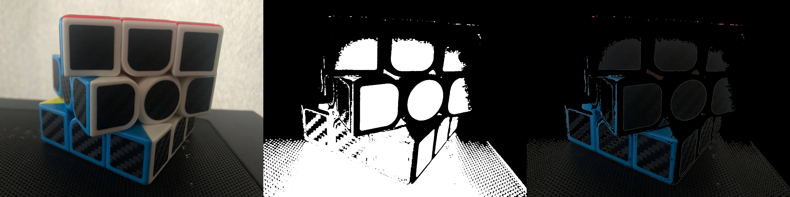
#### Imagem 9
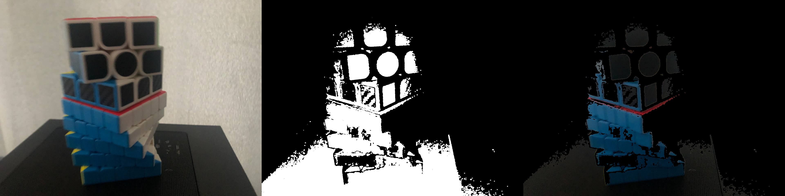

### Objeto 2
#### Imagem 1
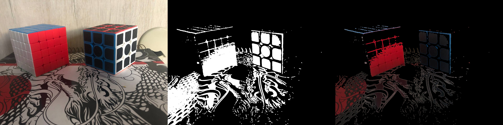
#### Imagem 2

#### Imagem 3
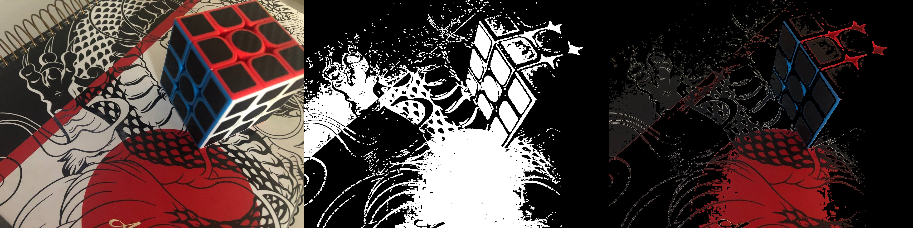
#### Imagem 4
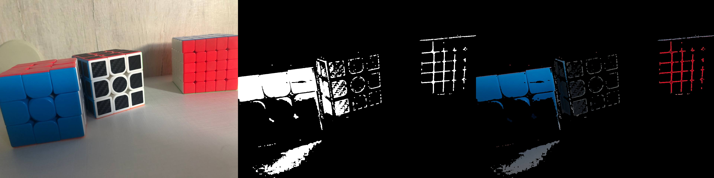
#### Imagem 5

#### Imagem 6

#### Imagem 7
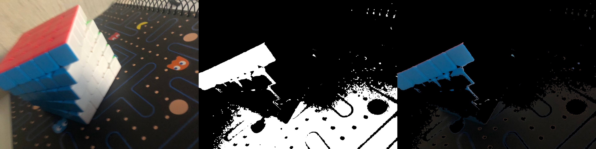
#### Imagem 8
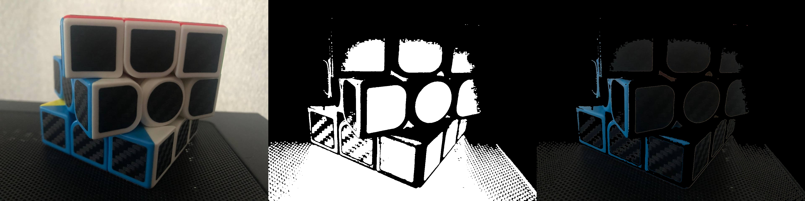
#### Imagem 9


### Objeto 3
#### Imagem 1

#### Imagem 2
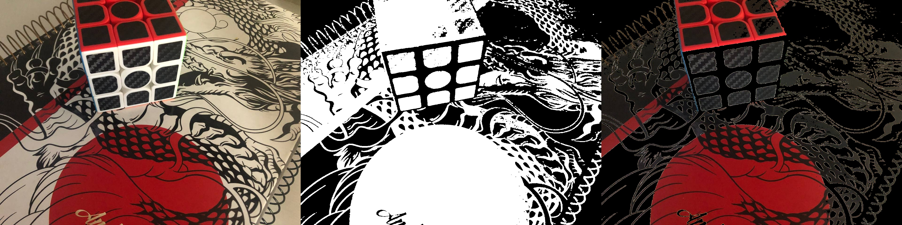
#### Imagem 3
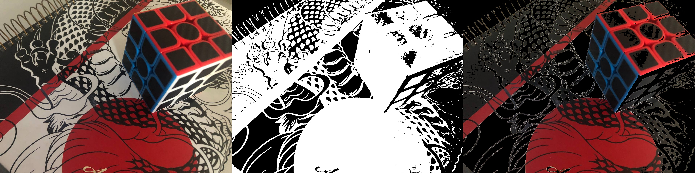
#### Imagem 4
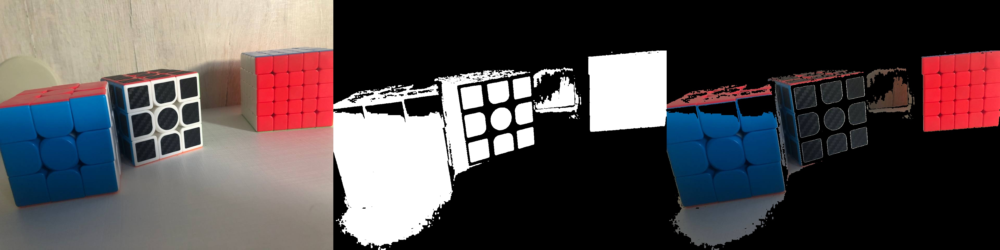
#### Imagem 5
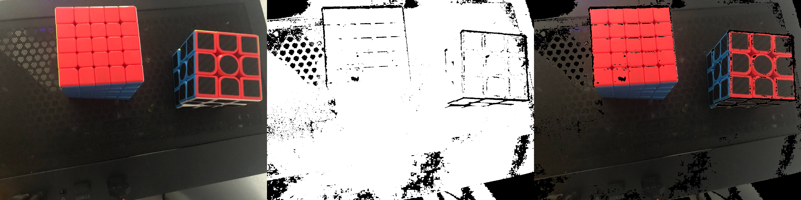
#### Imagem 6
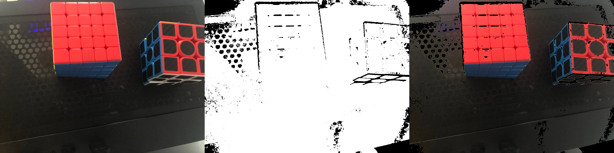
#### Imagem 7

#### Imagem 8

#### Imagem 9


### Objeto 4
#### Imagem 1

#### Imagem 2

#### Imagem 3

#### Imagem 4

#### Imagem 5

#### Imagem 6
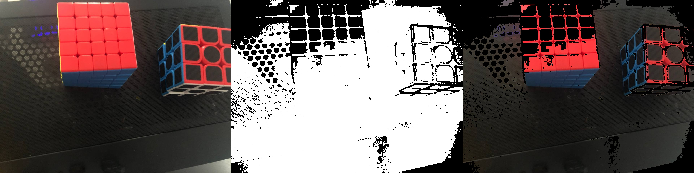
#### Imagem 7
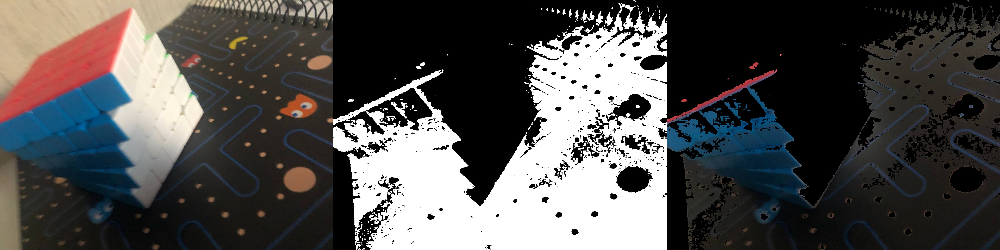
#### Imagem 8

#### Imagem 9


## Conclusões

Como esperado, a indexação por cores apresenta várias falhas se levarmos ela ao
extremo, com cores repetidas pela imagem inteira, ângulos diferentes e
iluminações diferentes, de modo que utilizar esse método eficazmente envolve
mais do que foi feito no trabalho.

Entretanto, como visto no exemplo do OpenCV citado acima, é um método
extremamente útil principalemente para objetos grandes e "simples" como
a grama em uma imagem de um jogador de futebol em campo, onde fica bem
distinto o objeto do resto da cena só pelas cores.


Em particular, a imagem 4 se comportou muito bem, pois não havia tanta
"interferência", isso é, as cores estavam bem distribuídas e para certos
objetos ficou **bem** fácil de ver eles após o processamento.
